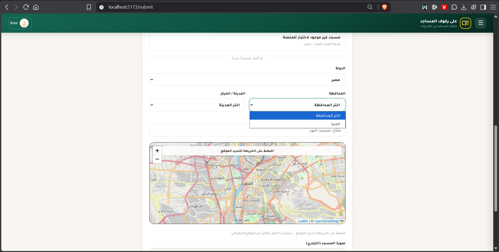
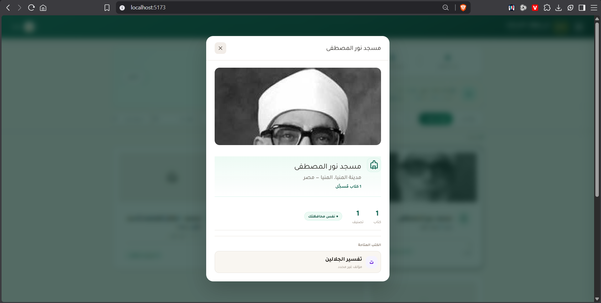

## Main Page

### Search
The search bar should be at the header both on phones and desktops for easier access.
Make the `.filter-category-strip` section a dropdown instead of a strip, and don't make it invisible on phones, and bring it in the place of the search section that you moved to the header to decrease vertical space usage.

### Mosque Pages/View
- When Viewing a mosque I don't see its image in the provided page itself
- The full page of the books and mosques are really bad, they are just small windows that don't show all info, like the mosques window, which doens't show the interactive map.

## Submit Page

- When I tried to add a new mosque, the "المحافظة" section only had the one governerate that has a mosque submitted before, it didn't allow me to submit a new governrate. See issue i this image: 
- The interactive map is no were near as good as Google Maps, it's so bad, it doesn't have marks for the mosques that were submitted before, When I set a location for a mosque and try to browse for it in the home page, I don't see the map anywhere.
- Here you can see on the home page that the mosque I submitted doesn't have an interactive map showing its location: .
- New Feature: There should be an option in the book section to allow people to add a picture of the book itself
- New Feature: There should be an option in the mosques section to add multiple images not just one, to allow people to add multiple images from more than one angle to the mosque + an image of the library inside the mosque itself. And all of that must be visible on the home page ofcourse.

## The "عن المنصة" Page
- I don't know where do the user feedback go from the contact section? 
- The page itself isn't that informative, its missing info like 